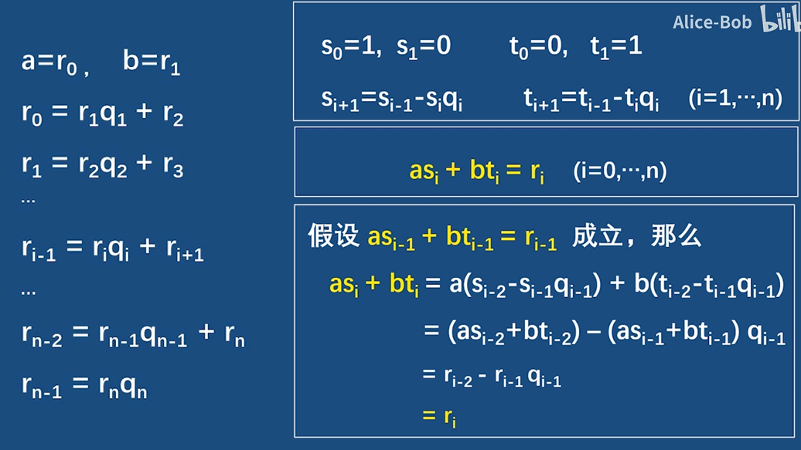
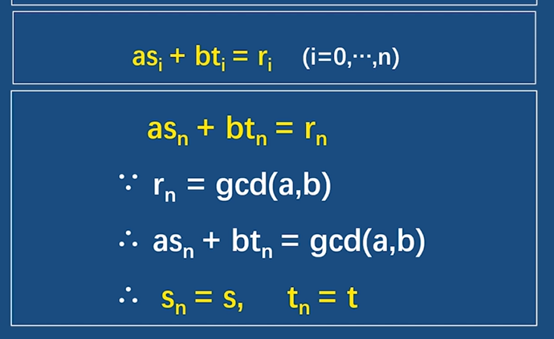

## 扩展欧几里得算法

### 第一种 - 顺序

左半部分是gcd的求解过程，后半部分是扩展欧几里得算法的求解过程。

第一个框中是算法的迭代公式，第二个框中是每一个r都存在s和t满足公式。第三个框中是证明过程，将第一个框中的s和t的迭代公式带入。

当i = 0和1时，可看出成立初始化条件。





### 第二种 - 递归
```C#
int gcd(int a,int b)
{
    return b?gcd(b,a%b):a;
}
```
可以看出，这是一个递归求解的函数。在函数递归到最后的时候，存在 b = 0 ，不管 a 是什么，这时显然有一对整数 x= 1 , y= 0 来使得：

a × 1+ 0 × 0 = gcd(a , 0)

那么，我们通过这个递归的实现过程来进行回溯的模拟。当 b>0 ，则程序还可以继续往下走： gcd(b , a % b)= gcd(a , b)。这时假设存在一对整数 x , y ，使得其一定会满足b × x+(a % b)× y= gcd(b , a % b)

因为 a % b= a − b ⌊ a / b ⌋ ，所以有以下的推导：

b × x+(a % b)× y= gcd(b , a % b)= b x+(a − b ⌊ a / b ⌋)y= a y − b(x − ⌊ a / b ⌋ y)

这个时候令 x ′= y , y ′= x − ⌊ a / b ⌋ y ，再结合一开始的原式子，就得出：

a x ′+ b y ′= gcd(a , b)

因为欧几里得算法的实现是递归的，而我们已经推出其中一个递归过程的实现，那么其他的递归过程就可以借助数学归纳法，一层层地向上推，必然会得出最终结论。

## 应用
1. 求解不定方程
2. 求解模的逆元
3. 求解线性同余方程